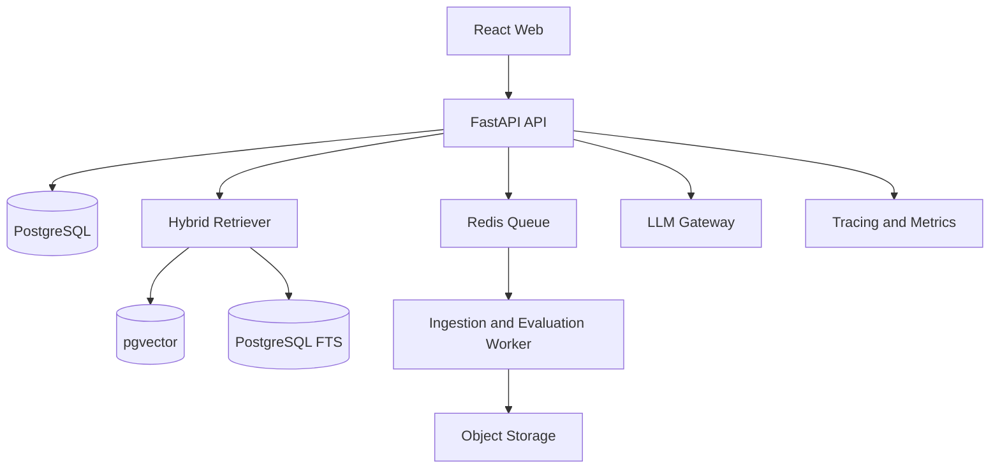

# PROJECT 01 — VIETNAM LEGAL RAG

> Web platform tra cứu Luật Lao động, Bảo hiểm xã hội và Thuế thu nhập cá nhân có trích dẫn, hiệu lực theo thời gian và bộ đánh giá RAG nhiều cấp độ.

## 1. Kết luận sản phẩm

**Tên demo:** Vietnam Legal RAG  
**Định vị:** AI Application Engineer / RAG Engineer / Production LLM Engineer  
**Người dùng:** Nhân sự, kế toán, chủ doanh nghiệp nhỏ và người lao động cần tìm quy định chính xác.  
**Giá trị thật:** Không chỉ “chat với PDF”. Hệ thống trả lời dựa trên văn bản pháp luật, chỉ rõ điều/khoản, văn bản nguồn, ngày hiệu lực và cảnh báo khi văn bản đã hết hiệu lực hoặc có văn bản thay thế.

### Vì sao chọn pháp luật thay vì y tế?

- Dữ liệu luật có cấu trúc điều/khoản, quan hệ sửa đổi/thay thế và mốc hiệu lực — phù hợp để thể hiện advanced RAG.
- Có thể xây evaluation dataset với câu trả lời kiểm chứng được.
- Ít rủi ro hơn chatbot tư vấn bệnh hoặc thuốc cho cá nhân.
- Phù hợp doanh nghiệp, ngân hàng, bảo hiểm, HRTech và GovTech.
- Thể hiện được document intelligence, temporal retrieval, citation verification và guardrail.

### Scope domain MVP

Chỉ nhập các văn bản liên quan:

1. Bộ luật Lao động.
2. Luật Bảo hiểm xã hội và văn bản hướng dẫn chính.
3. Luật Thuế thu nhập cá nhân và văn bản hướng dẫn chính.
4. Một số nghị định/thông tư sửa đổi trực tiếp các nhóm trên.

Không nhập toàn bộ pháp luật Việt Nam trong MVP. Mục tiêu là khoảng 30–100 văn bản được chọn và kiểm tra kỹ.

## 2. Câu hỏi sản phẩm phải trả lời được

- Người lao động nghỉ việc cần điều kiện gì để hưởng trợ cấp thất nghiệp?
- Người sử dụng lao động được thử việc tối đa bao lâu với vị trí kỹ thuật?
- Làm thêm vào ngày nghỉ được trả tối thiểu bao nhiêu phần trăm?
- Khoản giảm trừ gia cảnh được áp dụng theo văn bản nào và có hiệu lực từ khi nào?
- Quy định hiện hành khác gì so với phiên bản trước ngày X?
- Hai văn bản đang mâu thuẫn hay một văn bản đã thay thế văn bản còn lại?

Hệ thống không được trả lời chắc chắn nếu không tìm thấy căn cứ phù hợp.

## 3. Các cấp độ RAG cần triển khai

Mỗi câu hỏi có thể chạy trên một hoặc nhiều pipeline và so sánh kết quả.

| Level | Pipeline | Mục tiêu chứng minh |
|---|---|---|
| L0 | LLM không retrieval | Baseline và hallucination rate |
| L1 | Dense vector retrieval | Embedding, chunking và cosine similarity |
| L2 | Vector + metadata filter | Lọc loại văn bản, cơ quan, domain, thời gian hiệu lực |
| L3 | Hybrid BM25 + vector | Kết hợp từ khóa pháp lý chính xác với semantic search |
| L4 | Hybrid + reranker | Cross-encoder reranking và cải thiện Recall/NDCG |
| L5 | Query rewrite + multi-query | Xử lý câu hỏi nói thường, từ viết tắt và nhiều ý |
| L6 | Parent-child retrieval | Trả đúng điều/khoản nhưng giữ đủ ngữ cảnh chương/văn bản |
| L7 | Temporal/relationship RAG | Xử lý hiệu lực, sửa đổi, thay thế và quan hệ văn bản |
| L8 | Agentic RAG | Agent tự phân rã câu hỏi, chọn bộ lọc, kiểm chứng citation |

MVP bắt buộc hoàn thành L0–L4 và L7. L5, L6 và L8 là stretch goal.

## 4. Tính năng web

### 4.1 Người dùng

- Đăng nhập và quản lý phiên làm việc.
- Chọn phạm vi Lao động, BHXH hoặc Thuế TNCN.
- Nhập câu hỏi và chọn ngày cần áp dụng pháp luật.
- Nhận câu trả lời có citation đến đúng văn bản, điều và khoản.
- Mở ngay đoạn nguồn được sử dụng; highlight đoạn chứng minh.
- Xem cảnh báo “văn bản hết hiệu lực”, “có văn bản thay thế” hoặc “không đủ căn cứ”.
- So sánh câu trả lời giữa Basic RAG và Advanced RAG.
- Gửi phản hồi đúng/sai/thiếu căn cứ.

### 4.2 Quản trị dữ liệu

- Upload PDF/DOCX/HTML/TXT.
- Khai báo số hiệu, loại văn bản, cơ quan ban hành, ngày ban hành, ngày hiệu lực và ngày hết hiệu lực.
- Khai báo quan hệ sửa đổi, bổ sung, thay thế, hướng dẫn.
- Parse cấu trúc chương, mục, điều, khoản và điểm.
- Preview chunk trước khi indexing.
- Re-index một tài liệu hoặc toàn knowledge base.
- Theo dõi trạng thái ingest, lỗi parse và phiên bản index.

### 4.3 Evaluation dashboard

- Chọn evaluation dataset và pipeline.
- Chạy benchmark bất đồng bộ.
- So sánh Recall@K, MRR, NDCG, citation accuracy, faithfulness, latency và cost.
- Drill down từng câu hỏi, retrieved chunks, reranking score và lỗi.
- Xuất báo cáo Markdown/CSV.

## 5. Kiến trúc



### Stack chốt

- Frontend: React, TypeScript, Vite, Tailwind CSS.
- Backend: Python 3.12, FastAPI, Pydantic 2, SQLAlchemy 2, Alembic.
- Database: PostgreSQL 16, pgvector, PostgreSQL full-text search.
- Queue: Redis + Dramatiq hoặc Celery.
- Storage: MinIO/S3-compatible.
- LLM: OpenAI/Claude qua provider abstraction; Ollama là tùy chọn local.
- Embedding: multilingual-e5 hoặc BGE-M3; cấu hình được.
- Reranker: BGE reranker hoặc cross-encoder multilingual.
- Evaluation: Ragas/DeepEval kết hợp evaluator deterministic tự viết.
- Observability: OpenTelemetry, Prometheus, Grafana hoặc Langfuse.
- Deployment: Docker Compose; k3s là stretch goal.

Không dùng Elasticsearch trong MVP. PostgreSQL FTS + pgvector đủ chứng minh hybrid search và dễ deploy.

## 6. Mô hình dữ liệu tối thiểu

### legal_documents

- id
- document_number
- title
- document_type
- issuing_authority
- issued_date
- effective_from
- effective_to
- status
- source_url
- source_file_path
- checksum
- version

### legal_provisions

- id
- document_id
- chapter
- section
- article
- clause
- point
- content
- normalized_content
- metadata
- embedding

### document_relations

- source_document_id
- target_document_id
- relation_type: amends, supplements, replaces, guides
- effective_from
- note

### rag_runs

- id
- user_id
- question
- applicable_date
- pipeline_level
- rewritten_queries
- retrieved_provision_ids
- answer
- citations
- latency_ms
- input_tokens
- output_tokens
- estimated_cost
- model_version
- prompt_version

### evaluation_cases

- id
- question
- applicable_date
- expected_document_ids
- expected_provision_ids
- reference_answer
- tags
- reviewed_by

## 7. Retrieval pipeline

1. Chuẩn hóa câu hỏi, giữ nguyên số hiệu/điều/khoản nếu có.
2. Phân loại domain và xác định ngày áp dụng.
3. Query rewrite có kiểm soát; không làm mất thuật ngữ pháp lý.
4. Lọc văn bản theo hiệu lực tại ngày áp dụng.
5. Chạy BM25/FTS và vector retrieval song song.
6. Reciprocal Rank Fusion để gộp kết quả.
7. Rerank top candidates.
8. Mở rộng parent context theo điều/chương.
9. Sinh câu trả lời chỉ từ context được duyệt.
10. Citation verifier kiểm tra từng claim có nguồn hỗ trợ.
11. Nếu evidence thấp: trả “chưa đủ căn cứ” và gợi ý phạm vi cần bổ sung.

## 8. Chunking cho văn bản pháp luật

Không chunk cố định 500 token một cách mù quáng.

- Đơn vị nhỏ nhất: điểm hoặc khoản.
- Parent: điều.
- Grandparent: mục/chương.
- Mỗi chunk lưu số hiệu văn bản, điều, khoản, điểm và thời gian hiệu lực.
- Không tách tiêu đề điều khỏi nội dung.
- Giữ cross-reference như “theo khoản 2 Điều 5”.
- Deduplicate theo checksum và định danh văn bản.

## 9. Guardrail và bảo mật

- Hiển thị rõ đây là công cụ tra cứu, không thay thế tư vấn pháp lý chuyên nghiệp.
- Chỉ trả lời dựa trên nguồn đã index.
- Cấm model tự tạo số hiệu văn bản hoặc điều khoản.
- Citation verifier phải xác nhận văn bản tồn tại trong database.
- Prompt injection trong tài liệu không được trở thành system instruction.
- File upload được kiểm tra MIME, dung lượng và antivirus nếu triển khai public.
- RBAC: admin, curator, evaluator, user.
- Audit log cho ingest, re-index, prompt/model change.
- Không đưa dữ liệu người dùng vào log hoặc evaluation công khai.

## 10. Evaluation bắt buộc

### Dataset

- Tối thiểu 100 câu hỏi.
- Ít nhất 25 câu Lao động, 25 câu BHXH, 25 câu Thuế TNCN.
- Ít nhất 15 câu temporal: hỏi tại các mốc thời gian khác nhau.
- Ít nhất 10 câu không đủ dữ liệu để kiểm tra abstention.
- Mỗi case có expected document và expected provision.

### Metrics

- Retrieval Recall@5 và Recall@10.
- MRR và NDCG@10.
- Citation precision/recall.
- Faithfulness hoặc groundedness.
- Answer correctness có human review.
- Abstention accuracy.
- P50/P95 latency.
- Token và chi phí trung bình mỗi câu hỏi.

### Target demo

- Recall@10 từ 0.85 trở lên trên bộ test nội bộ.
- Citation precision từ 0.90 trở lên.
- Không hallucinate citation trong bộ test.
- P95 dưới 8 giây với external LLM, không tính cold start.
- Advanced pipeline tốt hơn L1 về Recall/NDCG và có bảng chứng minh.

Không sửa evaluation set để làm đẹp metric. Tách rõ development set và final test set.

## 11. API chính

```text
POST   /api/v1/auth/login
POST   /api/v1/knowledge-bases
POST   /api/v1/documents
GET    /api/v1/documents/{id}
POST   /api/v1/documents/{id}/index
POST   /api/v1/query
POST   /api/v1/query/compare
GET    /api/v1/runs/{id}
POST   /api/v1/evaluations
GET    /api/v1/evaluations/{id}
GET    /api/v1/evaluations/{id}/report
```

`POST /query` phải trả structured output gồm answer, citations, retrieved provisions, confidence, warnings, pipeline version, latency và cost.

## 12. Cấu trúc repository

```text
vietnam-legal-rag/
├── apps/
│   ├── api/
│   ├── worker/
│   └── web/
├── packages/
│   ├── ingestion/
│   ├── retrieval/
│   ├── generation/
│   ├── evaluation/
│   └── observability/
├── data/
│   ├── samples/
│   └── evaluation/
├── deploy/
│   ├── docker/
│   └── k8s/
├── docs/
│   ├── architecture.md
│   ├── data-card.md
│   ├── evaluation-report.md
│   ├── security.md
│   └── adr/
├── tests/
├── docker-compose.yml
├── Makefile
├── .env.example
└── README.md
```

## 13. Definition of Done

- [ ] `docker compose up -d` chạy toàn bộ hệ thống.
- [ ] Có seed knowledge base và ít nhất 30 văn bản.
- [ ] Có parser cấu trúc điều/khoản, không chỉ fixed-token chunking.
- [ ] Hoàn thành L0–L4 và temporal filter L7.
- [ ] Câu trả lời có link tới đúng document/article/clause.
- [ ] Có compare UI cho tối thiểu hai pipeline.
- [ ] Có evaluation dataset tối thiểu 100 câu.
- [ ] Có report so sánh quality, latency và cost.
- [ ] Có unit, integration và end-to-end test cho happy path.
- [ ] Có JWT/RBAC, audit log và rate limit.
- [ ] Có OpenAPI, healthcheck, structured logging và tracing.
- [ ] CI chạy lint, type check, test, build và security scan.
- [ ] Có URL demo, tài khoản demo và video 5–7 phút.
- [ ] README tiếng Anh mô tả quyết định kỹ thuật và limitations.

## 14. Demo script cho phỏng vấn

1. Giới thiệu bài toán: tìm đúng quy định đang có hiệu lực, không chỉ tìm đoạn giống nghĩa.
2. Hỏi cùng một câu ở L0 và L4; chỉ ra hallucination hoặc thiếu citation của L0.
3. Mở retrieved chunks, BM25/vector score và reranker result.
4. Đổi ngày áp dụng để chứng minh temporal retrieval.
5. Mở citation về đúng điều/khoản trong tài liệu.
6. Chạy evaluation dashboard và so sánh Recall/NDCG/latency/cost.
7. Mở trace của một request và giải thích pipeline.
8. Kết thúc bằng limitation và kế hoạch scale.

## 15. Những điểm cần nói để nhà tuyển dụng pass

- “Tôi xây hệ thống retrieval có evaluation, không đánh giá bằng cảm giác.”
- “Tôi xử lý hiệu lực và quan hệ sửa đổi/thay thế ở retrieval layer, không để LLM tự suy đoán.”
- “Tôi dùng hybrid retrieval vì văn bản pháp luật vừa cần semantic similarity vừa cần khớp chính xác số hiệu và thuật ngữ.”
- “Mọi answer claim đều phải đi qua citation verification.”
- “Tôi đo quality, P95 latency và cost trên cùng evaluation set trước khi chọn pipeline.”
- “Hệ thống có ingestion queue, versioning, observability và audit để vận hành thật.”

## 16. Kế hoạch triển khai 8 ngày

### Ngày 1

- Scaffold monorepo, Docker Compose, database, auth.
- Chốt schema document/provision/relation.

### Ngày 2

- Upload và parser PDF/DOCX/HTML.
- Parse chương/điều/khoản; preview chunks.

### Ngày 3

- Embedding, pgvector và L1 retrieval.
- Query UI và citation viewer.

### Ngày 4

- Metadata/temporal filter.
- PostgreSQL FTS và hybrid fusion.

### Ngày 5

- Reranker, compare endpoint/UI.
- Structured answer và citation verifier.

### Ngày 6

- Evaluation dataset, runner và metrics.
- Trace, latency và cost tracking.

### Ngày 7

- Security, test, CI và failure handling.
- Evaluation report và error analysis.

### Ngày 8

- Deploy VPS, seed demo, README, architecture diagram và video.

## 17. Không làm trong MVP

- Không crawl toàn bộ cơ sở dữ liệu pháp luật.
- Không cung cấp tư vấn pháp lý cá nhân có tính quyết định.
- Không xây mobile app.
- Không fine-tune LLM lớn.
- Không triển khai microservices phức tạp.
- Không dùng Graph RAG nếu L0–L4 và temporal RAG chưa đạt metric.

